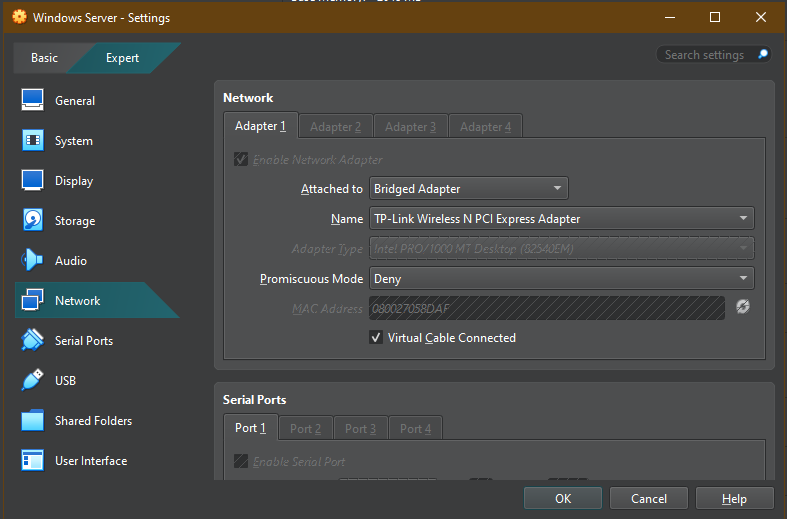

<h1>Domain Join and DNS</h1>

<h2>Overview:</h2> 

<h2>Objective</h2>

<h2>Environment:</h2>

<h2>Lab Task 1:</h2>

<h3>Verify DC and Roles</h3>

- Verify server is the domain controller
- Domain controller has Active Directory / DNS as a role/feature
  - If not, click link for instructions on how to: [VM Setup](https://github.com/tavyn-jackson/VM-Labs/blob/main/VMSetup-ADDS-DC/README.md)
 
 

<h2>Lab Task 2:</h2>

<h3>Find the Server IP Address</h3>

- Inside the VM, open the command prompt utility
- Find IPv4 address within adapter
  - VM server IPv4 address will be used as the DNS server for the domain join
- Write the IP address down

 

<h2>Lab Task 3:</h2>

<h3>Configure VM Software</h3>

- Within VM Software settings, go to Network settings
- Set adapter to : Bridged Adapter
  -  Bridged adapter connects the VM directly to the host machine’s physical network adapter
- Choose adapter in your settings

 

<h2>Lab Task 4:</h2>

<h3>Test Network Connectivity</h3>

- On the device joining the domain, ping the IP address written down
  - I ran a script that provides ping responses here -> [Ping Server Script](https://github.com/tavyn-jackson/Script-Labs/blob/main/Ping-Server/README.md)
- If done correctly, should get a response from server

 

<h2>Lab Task 5:</h2>

<h3>Test Domain Name Resolution</h3>

- On the joining device, search "View network connections"
- Riight-click adapter, select Properties
- Select "Internet Protocol Version 4 (TCP/IPv4)"
- Click Properties
- Select "Use the following DNS server addresses"
- Within the Preferred DNS server box insert VM server IP addresses
  
