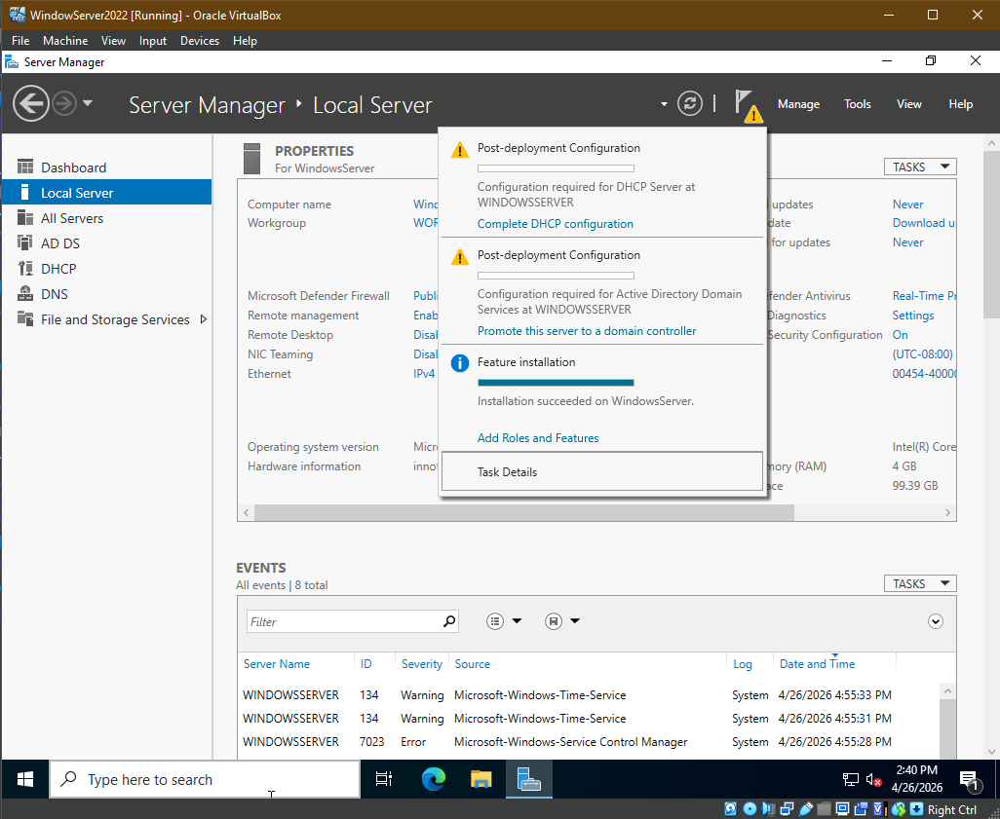
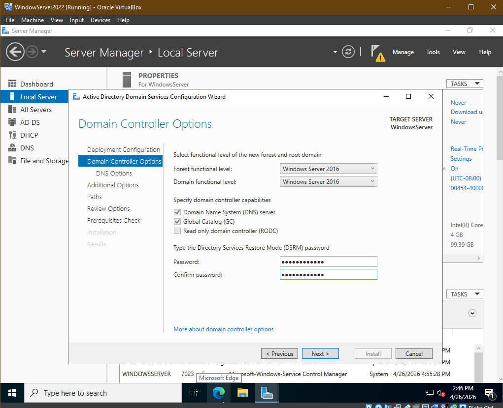
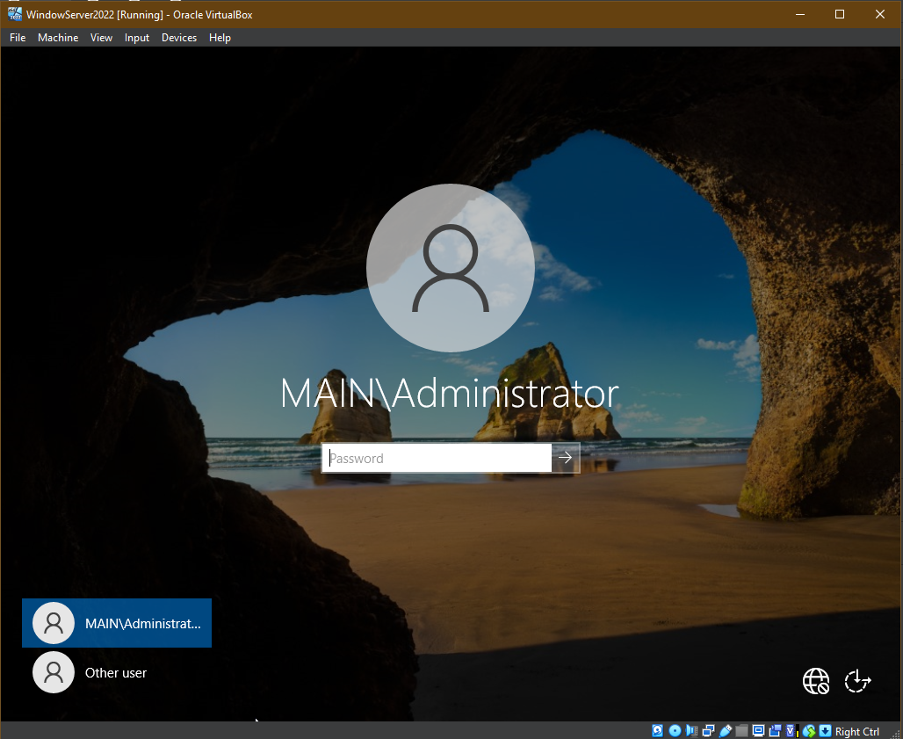

<h1>Promote Server / Add AD DS</h1>

<h2>Description</h2>
This project demonstrates the process of deploying and configuring an Active Directory Domain Service (AD DS) environment on a Windows Server 2022 virtual machine hosted in Oracle VirtualBox. This lab includes promoting a standalone server to a domain controller and adding Active Directory roles and features preparing the foundation for enterprise-level identity and access management. 

 

<h2>Purpose:</h2>
This lab was created to simulate a real-world enterprise envionment using Windows Server 2022 and Active Directory. The goal is to develop pratical experience in identity and access management, including organizing resources with Organizational Units, enforcing policies with Group Policy, and managing user permissions in a controlled domain environment. 

 

<h2>Lab Task:</h2>
- <b>Promote server to domain controller</b>
 
- <b>Add Active Directory role</b>

<h2>Promote server to Domain Controller:</h2>
 
- <b>Open VM software</b>
 
- <b>Start up VM</b>
 
- <b>After VM boots, login to VM OS with username and password</b>
 
- <b>Windows Server Manager will automatically start after login</b>
 
- <b>Within Server Manager, select the flag with the alert notification</b>
 
 

- <b>Click "Promote this server to a domain controller"</b>

 
- <b>Domain Controller Wizard Window will open</b>
 
- <b>Add needed roles and features </b>
 
 

- <b>Select forest options and set password for adminstrator account</b>

- <b>Confirm remaining settings and click Install </b>
 
- <b>After domain controller setup is finished, VM will require a restart to promote computer to Domain Controller</b>
 
 

- <b>After reboot, login using Administrator username and password created during the Domain Controller Wizard setup </b>

 
 
<h2>Add Active Directory roles and features:</h2>
 
- <b>After logging into admin account, select "Manage"</b>
 
 

- <b>Select "Add Roles and Features", roles and features selection window will prompt</b>
  

 
- <b>Select "Active Directory Domain Services"</b>
 
 

- <b>Finish Install, will require a reboot</b>

 
- <b>Will have to login back in using administrator information</b>
 
- <b>Server Manager will open, select Tools, Active Directory will now be listed as an option</b>
 

